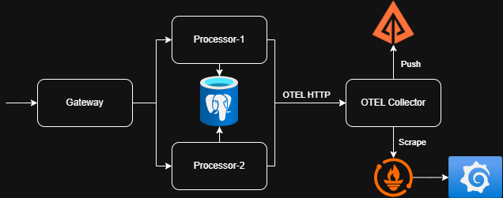

# Distributed Tracing with OpenTelemetry

In distributed tracing, a span is the primary building block of a trace. A trace is the end-to-end journey of a single request through your system, and spans are the individual steps along that journey.

Context propagation is the mechanism by which trace context (like trace IDs and span IDs) is passed along with requests as they travel through different services. This allows for the correlation of spans across services, enabling a complete view of the request's journey.

## About this project



This project demonstrates distributed tracing and observability across microservices using **OpenTelemetry**, **Zipkin**, **Prometheus**, and **Grafana**.

- A gateway service receives incoming requests and forwards them to one of two processor services.
- Each processor service handles the request and interacts with a database.
- Processors may randomly throw errors to simulate failure scenarios.
- All services are instrumented to export tracing and metrics data.
- Currently ZipKin stores all traces in-memory. Ideally, it should read from a persistent storage like Elasticsearch.
- Prometheus scrapes the collector service for metrics.

## Endpoints

- **Traces (Zipkin UI):** [http://localhost:9411/](http://localhost:9411/)
- **Gateway Swagger UI:** [http://localhost:8000/docs#/default/proxy_proxy_get](http://localhost:8000/docs#/default/proxy_proxy_get)
- **Prometheus Metrics:** [http://localhost:8889/metrics](http://localhost:8889/metrics)
- **Prometheus Targets:** [http://localhost:9090/targets](http://localhost:9090/targets)
- **Grafana Dashboard:** [http://localhost:3000/](http://localhost:3000/) (credentials: `admin/admin`)

## Stack

- Python (FastAPI)
- OpenTelemetry SDK
- Zipkin (Tracing backend)
- Prometheus (Metrics backend)
- Grafana (Metrics visualization)
- Docker Compose

## Running the project

```bash
docker-compose up --build -d
```
